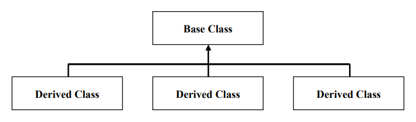
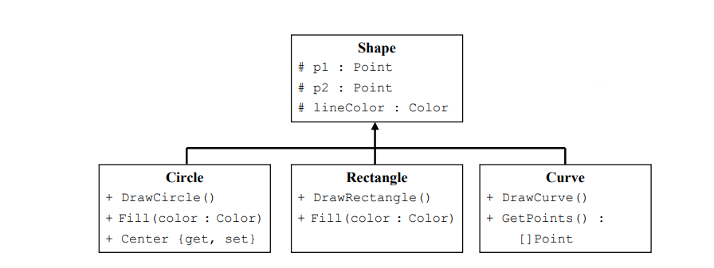

# Inheritance (Nedarv)
Genbrug er som sagt en vigtig del af OOP. 
Genbrugelighed (reusability) lader sig gøre i OOP
ved at man reducere couplingen mellem kode. Man udvider kode vha sub-classing. Ved hjælp af dette kan man 
udvide funktionaliteten af en klasse. Dette kaldes inheritance eller nedarv.

Den "øverste" klasse i hirakiet kaldes "baseclass", "super-class" eller "parent". 
De klasser der nedarver fra den kaldes "sub", "child", "derived", eller inherited class.

Kigger vi på et konkret eksempel kunne det se således ud:

